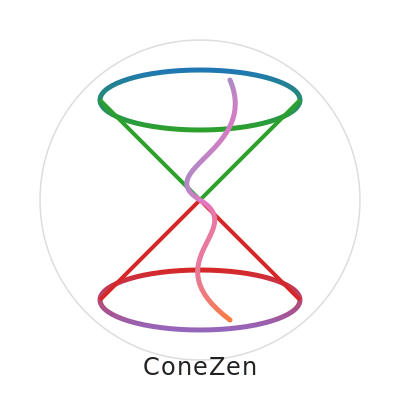

# 🌀 ConeZen

<p align="center">
  
</p>

<h1 align="center">ConeZen</h1>

<p align="center">
  <i>Visualiser for Conical Intersection Branching Planes</i>
</p>


# ConeZen

Copyright (C) 2025 Kalpajyoti Dihingia

**ConeZen** is an open-source Python tool for visualising the branching plane topology near a conical intersection (CI).

It uses nonadiabatic coupling (NAC) and gradient data from the **SHARC–OpenMolcas** interface to generate clear 3D plots and rotating animations.  
Ideal for computational chemists who want reproducible, publication-ready CI topology plots.

---

## 📌 Features
- Visualise CI branching planes in 3D.
- Generate static plots and smooth rotation animations (GIF/MP4).
- Tested with NAC and gradient data from SHARC–OpenMolcas.
- Fully open-source under GPLv3.
- Citation required for published work.

---

## ⚡ How to use

1. **Optimise** the CI geometry with SHARC–ORCA.
2. **Calculate** gradients & NACs with SHARC–OpenMolcas.
3. **Extract** `NAC.out`, `gradientA.out`, `gradientB.out`.
4. **Run:** `python3 ci_branching_plane.py` and follow prompts.

See `example_input/` for a working demo.


---
Repository structure

```
conezen/
│
├── ci_branching_plane.py              # Main Python script for CI branching plane visualization
├── requirements.txt                   # Python dependencies (numpy, matplotlib)
│
├── example_input/                     # Example input files (NAC, gradient vectors)
│   ├── NAC.out
│   ├── gradientA.out
│   ├── gradientB.out
│
├── example_output/                    # Example output files (optional: plots, animations)
│   ├── surfaces.png
│   ├── rotation.gif
│
├── LICENSE                            # GPL-3.0 License text
├── CITATION.cff                       # Citation file for GitHub citation badge
├── .zenodo.json                       # Zenodo metadata for DOI generation
├── ACKNOWLEDGMENTS.md                 # Acknowledgments for collaborators and mentors
├── CONTRIBUTING.md                    # Contribution guidelines
├── CODE_OF_CONDUCT.md                 # Contributor Code of Conduct
├── RELEASE_NOTES.md                   # Version history and changes
└──README.md                          # Main documentation, usage instructions, and citation info

```
---
## ✏️ Citation

If you use **ConeZen** for published research, please cite:
- **Kalpajyoti Dihingia**, *ConeZen: Visualiser for conical intersection branching planes* (Zenodo, DOI: TBD)
- The related scientific paper once published

```bibtex
@software{conezen_2025,
  author  = {Kalpajyoti Dihingia},
  title   = {ConeZen: Visualiser for conical intersection branching planes},
  year    = 2025,
  publisher = {Zenodo},
  version = {v1.0},
  doi     = {10.xxxx/zenodo.xxxxx}
}
